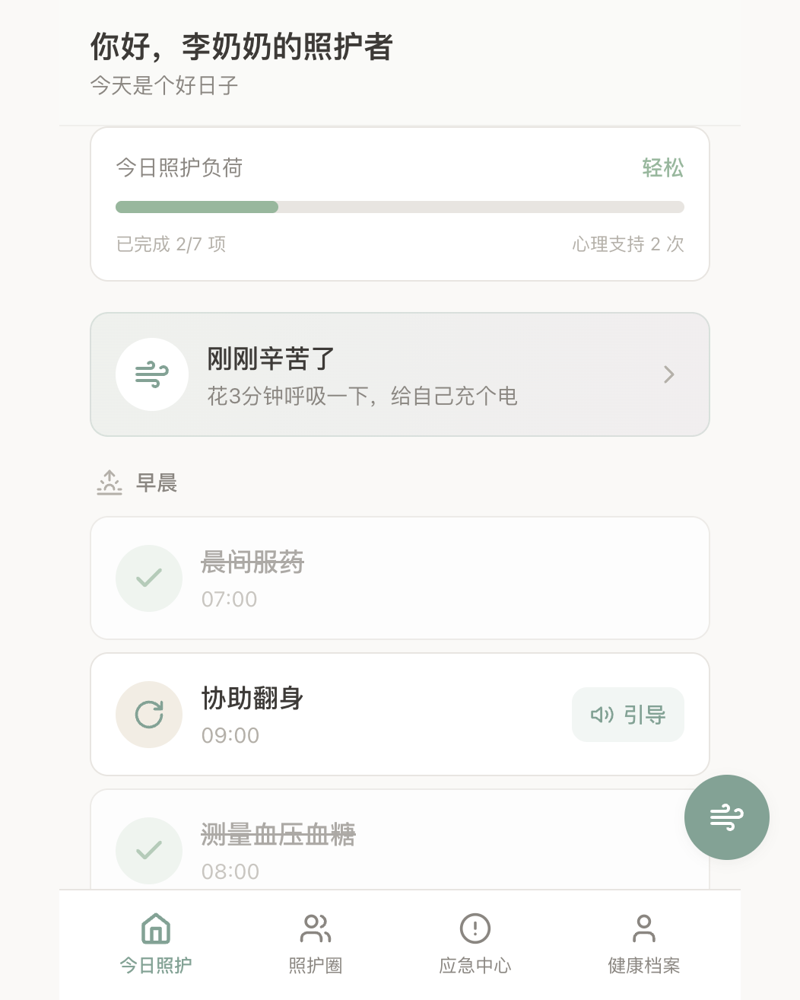
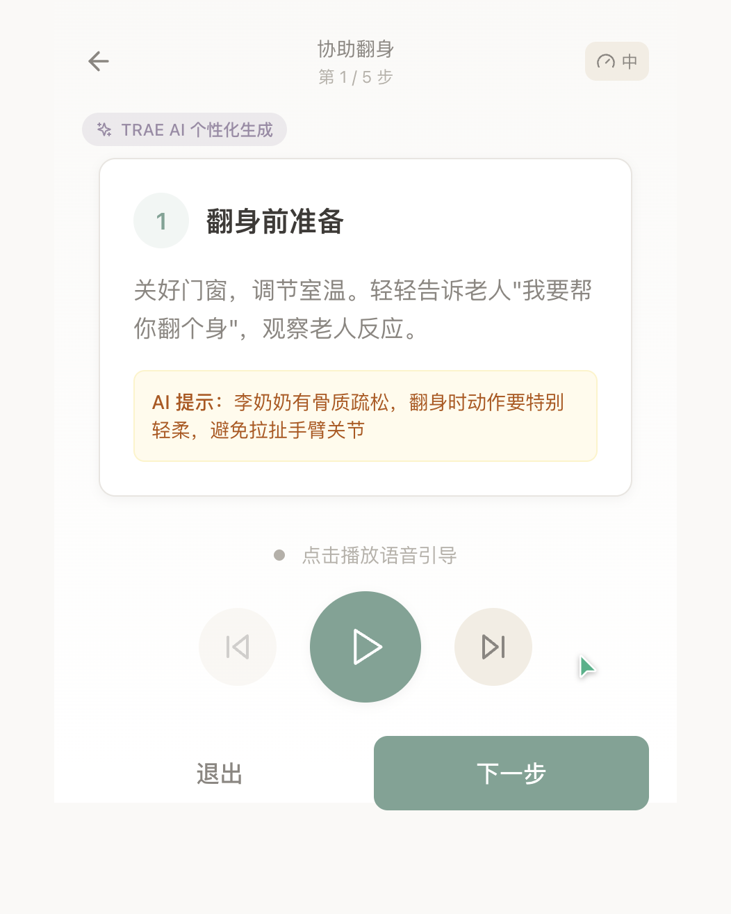
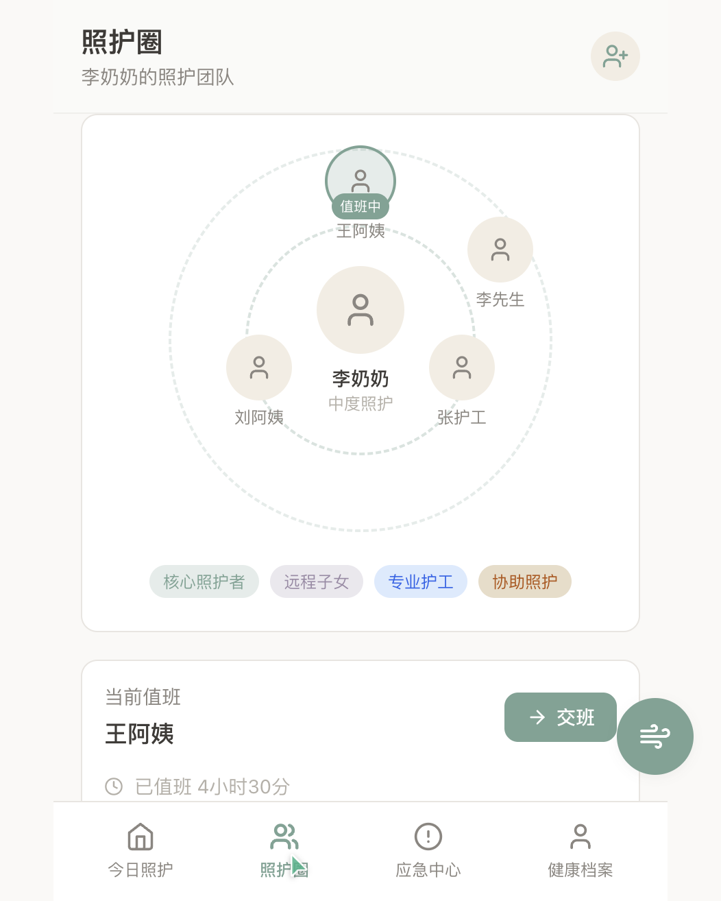

---

## 【标题】社会公益赛道 · 照护双环 — 嵌入式照护者心理支持与照护智慧协同

---

### 1. Demo 简介

**• 是什么**：

「照护双环」是一款深度融合 TRAE AI 能力的家庭养老照护协同工具，创新性地提出"双环"模型——**内环（心理支持环）** 将心理调节嵌入照护动作间隙，让照护老人的每一个停顿都成为照护自己的机会；**外环（智慧协同环）** 把专业照护知识、多人协作、应急响应织成一张网，让每位照护者都不是孤军奋战。

产品以"零额外负担"为核心设计理念，不要求照护者挤出时间"学习心理课程"，而是在完成翻身、喂药等照护任务后，自然弹出 3 分钟呼吸调节入口，将心理支持变成照护流程的一部分。

**• 面向谁**：

- **核心照护者**（50-70岁子女）：长期在家照顾老人的主要提供者，时间长、压力大
- **协助照护者**（亲属、邻里、护工）：不定期提供帮助，需要快速了解老人状况
- **远程子女**：外地工作，不在身边但想掌握老人情况、参与协同
- **准照护者**：即将开始照护，毫无准备、充满焦虑的人群

**• 主要功能**：

1. **TRAE RAG 动态语音引导**：基于 WHO 照护标准和国家"九防"规范知识库，根据老人的基础疾病（高血压、糖尿病、骨质疏松等）和当天状态，动态生成个性化照护步骤语音脚本，边做边学，学习时间趋近于零
2. **嵌入式心理调节**：完成照护任务后自动弹出 60-90 秒呼吸调节入口，采用 478 呼吸法 + 环形动效 + 语音引导，照护间隙即调节时机，时间成本降低 70-80%
3. **AI 语音交接班摘要**：照护者语音说几句交班话，TRAE 自动转文字并提取用药/饮食/情绪/身体四大模块摘要，异常关键词自动标红，交接准备时间从 10 分钟压缩到 30 秒
4. **同源多模态内容生成**：同一份照护知识，TRAE 一次性生成语音播报版、图文卡片版、A4 可打印版三种形态，适配不同文化水平的照护者
5. **应急急救指导**：噎食、跌倒等 5 大急救场景，分步语音指导 + 黄金救援时间倒计时
6. **多人照护圈协同**：成员环形排列，当前值班高亮，交接记录时间线永久可查

**产品界面展示**：

*今日照护首页 — 任务列表按时段排布，完成任务后自动弹出心理调节入口*

*TRAE RAG 动态语音引导 — 根据老人疾病和状态生成个性化步骤，关键注意事项 AI 自动提示*

*照护圈 — 多人交接班看板，AI 自动整理交接摘要，异常项红色高亮*

---

### 2. Demo 创作思路

**• 灵感来源**：

来源于对家庭照护者群体的长期观察和研究。在老龄化研究中发现一个被忽视的真相——**照护者的心理崩溃，往往先于老人的身体崩溃**。很多子女在长期照顾父母的过程中，默默承受着巨大的心理压力，但他们自己往往意识不到，也没有时间和精力去寻求帮助。

一个具体的场景触发了这个创意：一位 62 岁的阿姨在帮 88 岁母亲翻身之后，坐在床边发呆了 3 分钟。这 3 分钟的"间隙"，本来可以成为情绪调节的机会，但大多数时候只是被疲惫填满。于是产生了一个想法——**能不能让照护的每一个停顿，都变成照护自己的机会？**

这就是"嵌入式心理支持"的由来，也是"双环"模型的起点。

**• 想解决的问题**：

当前家庭养老照护领域存在三个根本缺陷：

1. **"额外负担"悖论**：市面上的心理调节方案（课程、冥想 APP）都要求照护者"挤出专门时间"来学习，但照护者最缺的就是时间。让一个已经忙到崩溃的人再去"学心理调节"，本身就在增加负担。
2. **知识碎片化**：WHO 照护标准、国家"九防"规范、慢性病护理要点这些专业知识，散落在学术论文和政府文件里，普通家庭找不到、看不懂、更不会用。
3. **多人照护信息黑洞**：子女和护工、家人之间的交接，大多靠微信群口头描述，用药遗漏、翻身记录断层、异常情况被忽略的情况频发，信息交接遗漏率高达约 23%。

**• 为什么做这个方向**：

- **市场空白**：现有养老产品几乎全部聚焦"老人端"（健康监测手表、呼叫器、摄像头），**照护者端**的心理支持和协同工具是明确的蓝海。但照护者才是整个家庭养老系统的基石——基石垮了，整个系统都会崩溃。
- **社会价值**：中国有超过 4000 万失能半失能老人，背后是上亿的家庭照护者。这个群体默默付出，却很少被看见。用技术支持他们，就是在支持千万个家庭。
- **AI 适配性高**：这个场景特别适合 AI 能力的发挥——RAG 让专业知识触手可及，语音交互解放照护者的双手，多模态生成让知识以最合适的形态触达每个人。TRAE 的出现，让这些想法可以快速从概念变成可运行的产品。
- **个人意义**：作为研究老龄化的博士，希望把学术研究中那些"生涩的论文"，变成真正能帮到人的应用。

---

### 3. Demo 体验地址

**• 部署体验链接**：https://qcflora.github.io/care-double/

> 源码仓库：https://github.com/qcflora/care-double
> 
> 纯前端单页应用，已通过 GitHub Pages 部署，点击上方链接即可在线体验完整功能。

---

### 4. TRAE 实践过程

**完整开发流程**：

**第一阶段：创意确认与产品设计（Day 1）**
- 从"照护者心理支持"这个切入点出发，梳理出"双环"产品模型
- 用 TRAE 辅助竞品分析，明确市场空白点
- 产出完整的产品设计规格文档，包含 12 个页面、交互流程、视觉规范
- 确定三大 AI 核心链路：RAG 语音引导、交接班摘要、多模态生成

**第二阶段：技术选型与项目搭建（Day 1）**
- 技术栈：React 18 + TypeScript + Vite + Tailwind CSS
- TRAE 辅助生成项目脚手架、配置文件、目录结构
- 配置温暖治愈色系的 Tailwind 主题（灰绿、暖沙、灰紫、暖米白）
- 建立全局状态管理（Context API + localStorage 持久化）

**第三阶段：AI 服务层开发（Day 2）**
- 构建 RAG 知识库：WHO 照护标准、国家"九防"规范、慢性病护理要点
- 实现 aiService 层：三大核心能力的 Prompt 工程 + 结构化输出
  - `generateGuideSteps()` — 动态引导生成
  - `generateHandoffSummary()` — 交接班摘要提取
  - `generateMultimodalContent()` — 多模态内容生成
- 集成语音合成（Web Speech API），支持 3 档语速调节
- 这是最核心的部分，也是 TRAE 价值最凸显的环节——从 Prompt 调试到知识库构建，TRAE 全程辅助

**第四阶段：核心页面开发（Day 2-3）**
- 启动引导页（身份选择，自动适配内容）
- 今日照护首页（任务列表 + 照护负荷指示 + 间隙调节入口）
- 语音引导照护页（TRAE 动态生成步骤 + 语音播报 + 进度指示）
- 嵌入式呼吸调节页（478 呼吸法 + 三层环形动效 + 语音引导）
- 照护圈页面（成员环形排列 + 交接看板 + 时间线）
- 交接班详情页（AI 摘要提取 + 异常标红 + 确认接班）
- 应急中心 + 急救指导页（5 大场景 + 倒计时）
- AI 多模态适配演示页（三态切换演示）

**第五阶段：闭环联调与细节打磨（Day 3）**
- 打通"选任务 → 语音引导 → 间隙呼吸 → 返回 → 交班 → 接班人查看"完整闭环
- localStorage 数据持久化，刷新不丢失状态
- 交互细节调优：呼吸动画参数、状态机、触控热区、无障碍设计
- 适老化优化：大字体模式、语音优先、高对比度

**关键步骤截图**（3张）：

1. **TRAE 辅助设计 AI 服务层** — 与 TRAE 对话调试 Prompt，从模糊需求到结构化输出，迭代了 5 个版本才达到满意效果
2. **RAG 知识库构建** — TRAE 辅助将 WHO 指南和九防规范拆解为可检索的知识片段
3. **闭环联调** — 完整走通"照护→调节→交班"全流程时的界面状态

**关键任务 Session ID**（4个）：

1. 产品设计与需求确认 Session
2. AI 服务层与 RAG 知识库构建 Session
3. 核心页面开发与组件复用 Session
4. 闭环联调与交互细节打磨 Session

---

### 👩‍🔬 开发者故事

**• 我是谁**：

我是一名研究老龄化的博士，但是进入了产假，本来感觉职业停滞自己陷入了育儿的旷野里，让我感觉个人价值流失。AI飞速发展让我看到了自己的创意价值，也许可以在更广泛、自由的模式上体现。日常决策事项很多，如果陷入日常，也许会忘了天空。于是让那些生涩的研究论文变成有价值的应用成为我的驱动力。

**• 创作初心**：

做「照护双环」的初心，源于两个身份的叠加——

作为**老龄化研究者**，我读过太多关于"照护者负担"的论文，知道这个群体的心理压力有多被忽视。数据是冰冷的，但每一个数据点背后，都是一个在深夜默默流泪的中年人。

作为**新手妈妈**，我在产假里亲身体验了什么叫"24小时不间断的照护"——那些碎片化的疲惫、那些自我价值的怀疑、那些想说又说不出口的情绪，我都懂。我也亲身体会到，"找专门时间做心理调节"有多难，而"在间隙里喘口气"有多重要。

这两个身份让我确信——**照护者自己，也是需要被照护的人。**

于是我想做一款产品，它不居高临下地教你"应该怎么照护"，而是温柔地陪着你，在你已经很努力的基础上，帮你多省一点力、多喘一口气、多一个人分担。

这就是「照护双环」的初心——**陪你一起照顾最爱的人，也别忘了照顾自己。**

**• TRAE 的价值**：

TRAE 对我来说，更像一个"创意实现的合伙人"，而不只是一个工具。

第一，**它让研究论文真正"活"了起来**。过去我的研究成果躺在论文里，只有同行会看。有了 TRAE，我可以把 WHO 指南、九防规范这些专业知识，快速变成 RAG 知识库，再变成每个照护者耳边的语音指导。知识不再是纸面的，而是可交互、可使用的。

第二，**它让"一个人的团队"成为可能**。我既是产品经理、设计师，又是开发者。放在以前，这需要一个团队花几个月做的事情，TRAE 帮我在几天内就做出了可运行的 Demo。从 Prompt 调试到组件代码，从架构设计到细节打磨，它全程都在。

第三，**它给了我试错的勇气**。有了 TRAE，一个想法从"脑子里的概念"到"可以上手体验的原型"，时间被极度压缩。这意味着我可以更勇敢地去尝试那些"听起来有点疯狂"的点子，因为试错成本足够低。

最重要的是——**TRAE 让我看到，即使在产假的"旷野"里，我依然可以创造价值。** 我不需要回到原来的轨道，也可以用新的方式，做有意义的事情。天空一直都在，只是我需要换一个角度去看。

---

### 🚀 未来扩展规划

* **短期（1-3个月）**：
  - 补充更多急救场景（目前仅完成噎食，还差跌倒、心脏骤停、烫伤、走失）
  - 丰富心理调节模式（身体扫描、情绪释放等）
  - 完善健康档案与健康评估功能
  - 接入真实的 ASR（语音转文字）能力，让语音交班更顺畅
  - 增加更多老人档案模板，覆盖更多疾病组合

* **中期（3-6个月）**：
  - 从纯前端升级为带后端的完整服务，支持多设备同步
  - 引入照护负荷算法，基于任务完成量、异常事件数、情绪状态等维度，动态评估照护者压力
  - 接入更多专业知识库（如阿尔茨海默症照护专病库、康复训练库）
  - 增加家庭医生/社区护士角色，连接专业照护资源
  - 支持生成月度照护报告，可打印可分享

* **长期（6-12个月）**：
  - 探索与社区养老服务的对接，成为居家照护与社区服务的连接点
  - 引入照护者互助社区，让有相似经历的人互相支持
  - 基于使用数据优化 RAG 知识库，让 AI 引导越来越"懂"每个家庭的具体情况
  - 探索适老化智能硬件的联动（如智能床垫、智能药盒）
  - 推动照护者心理支持的标准化，形成行业参考方案

---

### 💡 踩坑心得

**1. "嵌入式心理调节"的节奏很难拿捏**
一开始把呼吸调节做成了 5 分钟，用户测试反馈"还是太长了，等不及"。后来反复调整，从 5 分钟 → 3 分钟 → 75 秒（5 轮 478 呼吸），才找到那个"刚好能喘口气，又不会觉得耽误事"的平衡点。**做照护者产品，一定要站在"时间极度稀缺"的前提下思考。**

**2. RAG 知识库不是"堆料"越多越好**
最开始把整段整段的 WHO 指南都塞进去，结果生成的引导又长又学术，照护者根本听不懂。后来重新拆解，把知识打碎成"可复用的小片段"，每段不超过 200 字，并且要求生成结果控制在 5 步以内、语言口语化。**知识库的质量，远重于数量。**

**3. 语音交互的细节比想象中多**
- 语速：一开始用默认语速，老人反馈"太快了跟不上"，加了 0.8x 慢速档
- 音量：环境嘈杂时听不清，需要有明显的音量调节
- 重复：照护者手上沾着水/沾着药，没法点屏幕，需要"自动重播"和"语音唤醒"的考虑
- **语音不是"锦上添花"的功能，对很多照护者来说，这是主要的交互方式。**

**4. 温暖的设计语言需要"克制"**
最开始设计时，加了很多"治愈系"的插画和动效，结果显得很花哨，反而给人一种"不专业"的感觉。后来做了减法——去掉多余的装饰，保留干净的卡片、柔和的色彩、克制的微动效。**温暖不是靠堆出来的，而是靠恰到好处的体贴。**

**5. 多人协同的"信息分层"很重要**
最开始交接班页面把所有信息都平铺出来，结果页面很长，关键信息找不到。后来改成"摘要优先，详情可展开"的结构——先让接班人一眼看到"有什么异常、有什么待办"，再决定要不要看细节。**照护者的注意力是稀缺资源，信息呈现要"先给结论，再给过程"。**

---

**体验地址**：

https://qcflora.github.io/care-double/

> 源码仓库：https://github.com/qcflora/care-double
> 
> 纯前端单页应用，已通过 GitHub Pages 部署，点击链接即可在线体验。

---
